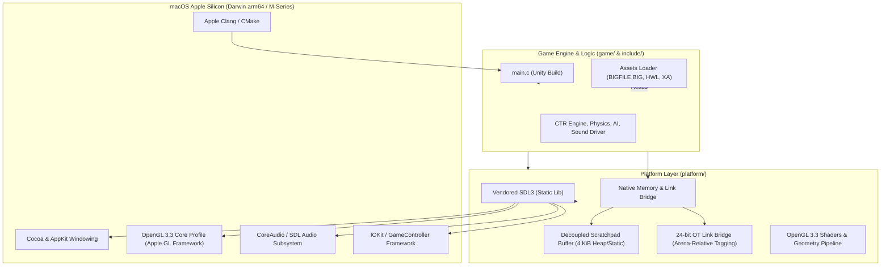
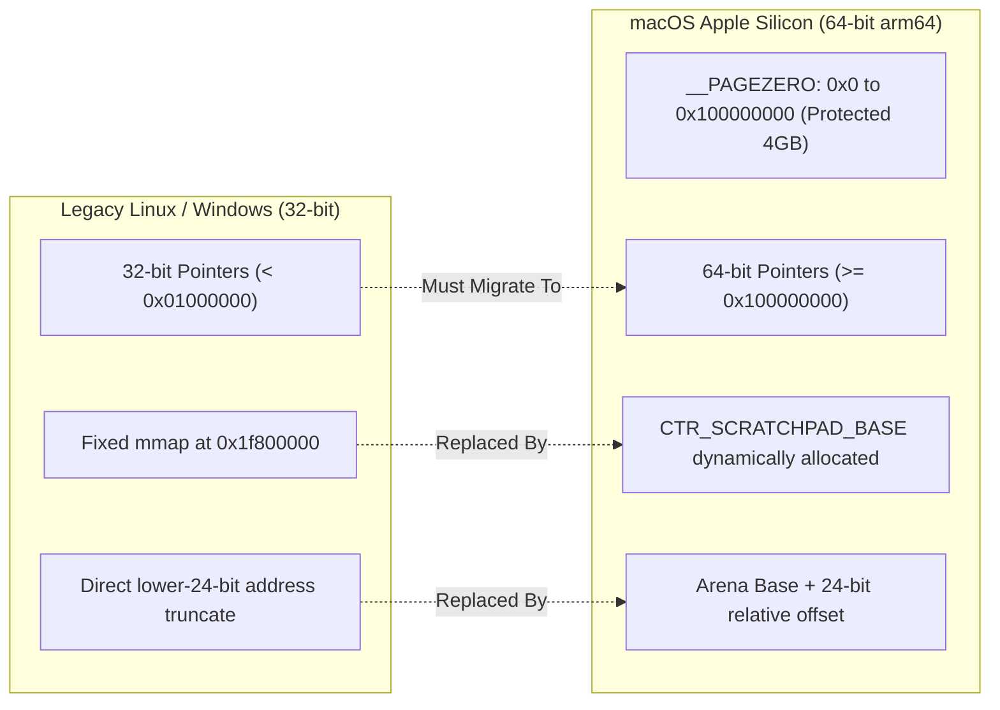

# macOS Apple Silicon Architecture & Memory Bridge Diagrams

## System Architecture

```mermaid
flowchart TD
    subgraph Host["macOS Apple Silicon (Darwin arm64 / M-Series)"]
        CLANG["Apple Clang / CMake"]
        COCOA["Cocoa & AppKit Windowing"]
        OGL["OpenGL 3.3 Core Profile (Apple GL Framework)"]
        AUDIO["CoreAudio / SDL Audio Subsystem"]
        INPUT["IOKit / GameController Framework"]
    end

    subgraph NativePlatform["Platform Layer (platform/)"]
        SDL3["Vendored SDL3 (Static Lib)"]
        MEMBRIDGE["Native Memory & Link Bridge"]
        SP_MEM["Decoupled Scratchpad Buffer (4 KiB Heap/Static)"]
        OT_BRIDGE["24-bit OT Link Bridge (Arena-Relative Tagging)"]
        RENDERER["OpenGL 3.3 Shaders & Geometry Pipeline"]
    end

    subgraph GameCore["Game Engine & Logic (game/ & include/)"]
        UNITY["main.c (Unity Build)"]
        CTR_LOGIC["CTR Engine, Physics, AI, Sound Driver"]
        ASSETS["Assets Loader (BIGFILE.BIG, HWL, XA)"]
    end

    CLANG --> UNITY
    UNITY --> GameCore
    GameCore --> MEMBRIDGE
    MEMBRIDGE --> SP_MEM
    MEMBRIDGE --> OT_BRIDGE
    GameCore --> NativePlatform
    NativePlatform --> SDL3
    SDL3 --> COCOA
    SDL3 --> OGL
    SDL3 --> AUDIO
    SDL3 --> INPUT
    ASSETS -.->|Reads| GameCore
```

## 64-bit Memory Model & Link Bridge

```mermaid
flowchart LR
    subgraph x86_32["Legacy Linux / Windows (32-bit)"]
        PTR32["32-bit Pointers (< 0x01000000)"]
        SP32["Fixed mmap at 0x1f800000"]
        OT32["Direct lower-24-bit address truncate"]
    end

    subgraph macOS_ARM64["macOS Apple Silicon (64-bit arm64)"]
        PAGEZERO["__PAGEZERO: 0x0 to 0x100000000 (Protected 4GB)"]
        PTR64["64-bit Pointers (>= 0x100000000)"]
        SP64["CTR_SCRATCHPAD_BASE dynamically allocated"]
        OT64["Arena Base + 24-bit relative offset"]
    end

    PTR32 -.->|Must Migrate To| PTR64
    SP32 -.->|Replaced By| SP64
    OT32 -.->|Replaced By| OT64
```
